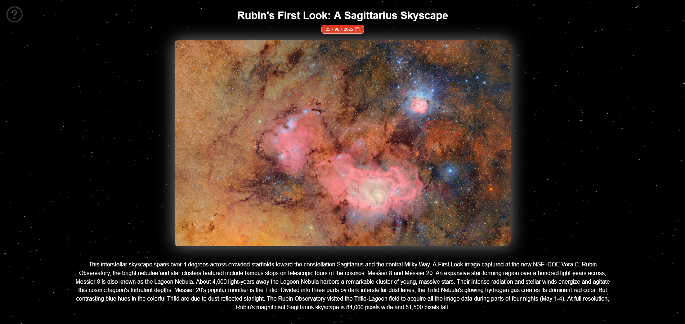
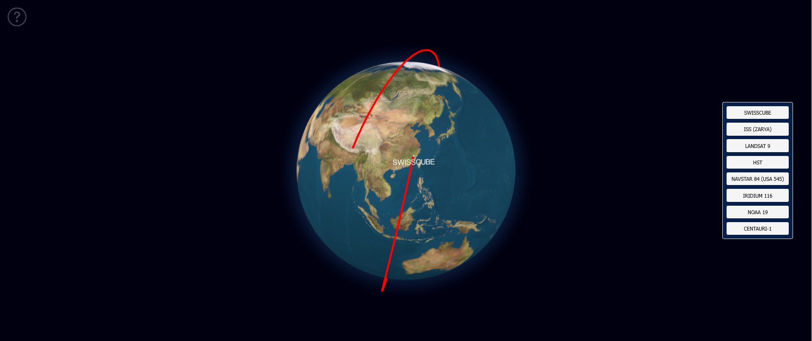

# Nasa Data Explorer

This project provides a visualisation for both the Astronomy Picture of the Day [(APOD)](https://en.wikipedia.org/wiki/Astronomy_Picture_of_the_Day) and satellite orbit paths from [TLEs](https://en.wikipedia.org/wiki/Two-line_element_set), through data provided by NASA APIs, which can be accessed [here](https://api.nasa.gov/).

## Example Screenshots
### APOD


### Satellite Orbit


# Getting Started

## Prerequisites
Before running, make sure you have the latest version of node installed with:
```
npm install -g npm@latest
```

### Installation
1. Obtain an API key from https://api.nasa.gov/
2. Clone the repo
    ```
    git clone https://github.com/bazir21/NasaDataExplorer.git
    ```
2. Install NPM packages for both frontend and backend
    ```
    cd frontend
    npm install

    cd backend
    npm install
    ```
3. Create a `.env` file in the `./backend/` folder and enter your API key like the following
    ```
    API_KEY = YOUR_API_KEY
    ```

### Running the Project
Once all the prerequisites are done, you have to run both the frontend and backend

* frontend
    ```
    cd frontend
    npm start
    ```

* backend
    ```
    cd backend
    npm run dev
    ```

Once both are running, you can access the frontend through http://localhost:3000/

# License
Distributed under the MIT License. See `LICENSE.txt` for more information.
